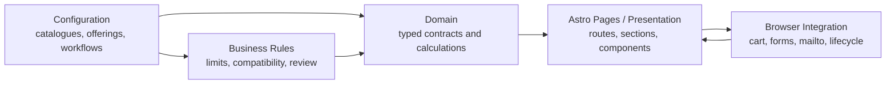
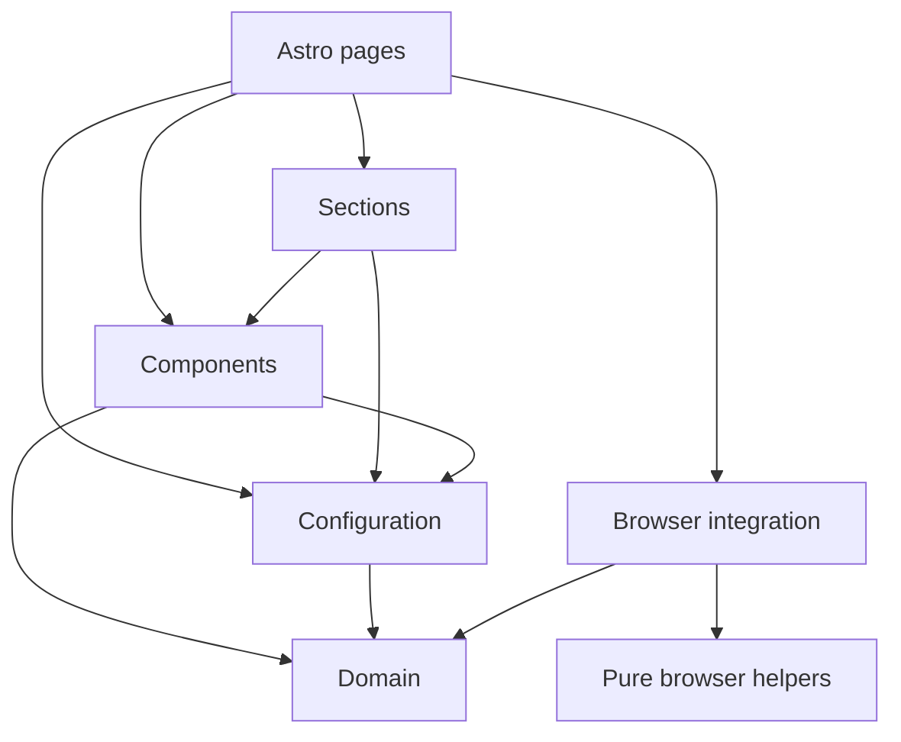

# Application Architecture

## Purpose

Earth Mama's Kitchen uses a configuration-driven Astro frontend architecture for three Product Offerings and one Service Offering.

The goal is professional maintainability without turning a small portfolio case study into a generic form engine, CMS, database-backed ecommerce platform, or enterprise framework exercise.

The project separates:

- domain contracts and business logic;
- approved configuration;
- Astro routes and presentation;
- browser integration;
- static assets and editorial content.

## Architectural principles

1. Business meaning is represented with stable IDs and typed contracts.
2. Reusable catalogues own shared data once.
3. Product Offerings compose catalogue entries instead of duplicating them.
4. Business Rules are declarative and limited to approved rule kinds.
5. Browser side effects stay outside the domain model.
6. Astro pages compose routes and presentation; they do not own reusable business rules.
7. Utilities must never contain business logic.
8. Abstractions are introduced only when there is a demonstrated repeated use case.

## Conceptual flow



At a high level, approved configuration and declarative Business Rules provide the data and constraints. The domain layer defines the stable contracts and reusable calculations. Astro pages and presentation components render the configured experience, while browser integration connects that rendered markup to local cart state, validation feedback, `mailto:` handoff and lifecycle behaviour.

## Current source structure

```text
src/
├── assets/          Assets imported into Astro/Vite
├── browser/         Browser lifecycle and DOM integration modules
├── components/      Reusable Astro components
├── configuration/   Approved catalogues, offerings, workflows, rules and metadata
├── consts/          Transitional presentation data used by the homepage catalogue
├── content/         Editorial content outside business configuration
├── domain/          Framework-independent contracts and business logic
├── layouts/         Shared Astro layout shell
├── models/          Transitional presentation model types
├── pages/           Astro route entrypoints
├── sections/        Page-level presentation sections
└── styles/          Global styles, tokens and shared CSS foundations
```

Folders are documented according to the current repository state. Empty target folders are not committed merely to mirror an ideal architecture.

## Domain layer

`src/domain` owns framework-independent business contracts and calculations.

It includes:

- stable ID and catalogue contracts;
- Product Offering and Service Offering types;
- Option Group types;
- Workflow Type contracts;
- declarative Business Rule types;
- allergen metadata contracts and derivation;
- pricing and money helpers using AUD cents;
- configuration selection and estimated-price structures.

Domain code must not import Astro, browser APIs, pages, sections, layouts, styles, or configuration data. It defines what the system means; it does not know which Product Offerings are currently approved.

## Configuration layer

`src/configuration` owns approved project data.

### Reusable catalogues

`src/configuration/catalogues` defines reusable catalogue entries such as:

- add-ons;
- add-on allergen profiles;
- allergens;
- colour palettes;
- cupcake flavours;
- decoration styles;
- fillings;
- frostings;
- occasions;
- sponge flavours.

Catalogue entries use stable lowercase kebab-case IDs. Customer-facing names can change; IDs should not.

### Offerings

Product Offering definitions live in `src/configuration/offerings/products`:

- `floral-cupcake-bouquets.ts`
- `edible-blooms.ts`
- `bespoke-cakes.ts`

The Service Offering definition lives in `src/configuration/offerings/services/events-catering.ts`.

Product Offerings reference catalogue IDs and own relationship-specific behaviour, including ordering, selection limits, supported add-ons, price overrides, review requirements, and rule references.

Catalogues do not contain reverse references to offerings. This keeps the Global Add-on Catalogue as the source of truth for add-on identity while each Product Offering owns how that add-on behaves in context.

### Workflow Types

Workflow definitions live in `src/configuration/workflows`:

- `guided-preorder` supports structured Product Offering configuration for Floral Cupcake Bouquets and Edible Blooms.
- `design-brief-preorder` supports Bespoke Cakes by combining structured selections with creative brief fields.
- `custom-enquiry` supports Events & Catering as a low-friction consultation enquiry.

Workflows share typed Option Group contracts but remain separate so workflow-specific fields do not leak into unrelated journeys.

### Declarative Business Rules

Rule instances live in `src/configuration/rules`.

Approved rule kinds are:

- `requires`;
- `excludes`;
- `auto-selects`;
- `limits-selection`;
- `redirects-to-enquiry`;
- `requires-review`.

Rules are grouped by responsibility:

- global rules;
- workflow rules;
- offering rules;
- compatibility rules.

Examples include cupcake flavour limits by size, Custom Colours requiring a description, vegan sponge auto-selecting Vegan Buttercream, Gluten Friendly sponge excluding incompatible fillings, and unsupported thresholds redirecting to Events & Catering.

## Presentation layer

Astro's conventional top-level folders remain visible:

- `src/pages` owns route entrypoints and static path generation.
- `src/layouts` owns the shared page shell.
- `src/sections` owns page-level content sections such as hero, Explore, awards, contact, header and footer.
- `src/components` owns reusable Astro components used by routes or sections.
- `src/styles` owns tokens, global styles and shared CSS foundations.

Presentation may import configuration and domain code to render approved data. It must not duplicate catalogue values or redefine business rules in markup.

## Browser integration layer

`src/browser` owns JavaScript that connects rendered Astro markup to browser APIs.

Current responsibilities include:

- cart state integration and rendering;
- preorder form state and validation wiring;
- order email handoff;
- Events & Catering mailto preparation;
- general contact mailto preparation;
- carousel lifecycle;
- Astro client-navigation lifecycle handling where required.

Browser modules may use localStorage, BroadcastChannel, DOM events, clipboard APIs and `mailto:` navigation. They should not import Astro components, pages, layouts, sections, styles, or configuration modules directly.

The current browser layer is intentionally JavaScript with JSDoc where needed. Browser TypeScript migration is not required for v1 unless a later issue explicitly owns it.

## Content and transitional presentation data

`src/content` stores editorial content such as awards.

`src/consts/explore.ts` and `src/models/product.model.ts` are transitional presentation data used by the homepage catalogue and visual summaries. They are not the authoritative domain model. New business configuration should use `src/configuration` and `src/domain`.

Keeping these files temporarily avoids coupling documentation/architecture work to unrelated visual refactors.

## Public assets

`public/` contains files that need stable browser-visible URLs, including favicons and product imagery used by browser-rendered cart summaries.

Assets imported into Astro/Vite live under `src/assets`.

The current image strategy is documented in [Asset Optimization Audit](ASSET_OPTIMIZATION_AUDIT.md). Moving all product images into `src/assets` would require a typed asset registry for browser scripts and is outside this documentation issue.

## Why Astro?

Astro fits this project because Earth Mama's Kitchen is primarily a content-rich, configuration-driven marketing and preorder experience rather than a continuously running client-side application.

The static-first model keeps public routes fast, crawlable and simple to deploy on Vercel. Astro pages can render Product Offering and Service Offering configuration at build time, which supports strong SEO defaults, predictable canonical routes and low runtime complexity. Its component model is still expressive enough for reusable sections, shared form shells and product configuration presentation without requiring a heavier frontend framework for every page.

This also supports the project's deliberate JavaScript boundary. Most content can be delivered as HTML first, while browser scripts are loaded only where interaction is needed: cart persistence, preorder validation, enquiry handoff, carousel lifecycle and Astro navigation integration.

The trade-off is that interactive behaviour requires explicit browser modules and stable markup contracts instead of framework-managed state everywhere. That is acceptable for the current scope because the application has lightweight local state, no backend session, no checkout, and no real-time server interaction.

## Dependency direction



Allowed direction:

| Layer               | May depend on                                                     |
| ------------------- | ----------------------------------------------------------------- |
| `src/domain`        | generic language/runtime APIs only                                |
| `src/configuration` | `src/domain`                                                      |
| `src/browser`       | `src/domain` and local browser helper modules                     |
| `src/components`    | `src/domain`, `src/configuration`                                 |
| `src/sections`      | `src/components`, `src/configuration`, assets                     |
| `src/pages`         | layouts, sections, components, configuration, browser entrypoints |
| `src/styles`        | CSS imports only                                                  |
| `src/content`       | data-only imports where needed                                    |

The ESLint configuration enforces the most important boundaries with `no-restricted-imports`. It also reserves `src/infrastructure` as a future technical-adapter layer, although that folder is not currently present.

## Import conventions

The project defines a single alias:

```text
@/* -> src/*
```

Use relative imports inside one cohesive folder. Use `@/*` when crossing top-level boundaries.

Examples:

```ts
import { workflowDefinitions } from '@/configuration/workflows/workflows';
import type { ProductOfferingDefinition } from '@/domain/offerings';
```

Conventions:

- prefer `import type` for type-only imports;
- avoid deep `../../../` imports when crossing architectural boundaries;
- do not introduce broad barrel files;
- stable IDs are lowercase kebab-case strings;
- Astro components use `PascalCase.astro`;
- TypeScript and JavaScript modules use kebab-case;
- customer-facing labels are not used as identifiers.

## Routing ownership

Product Offering detail routes use:

- `/our-creations/floral-cupcake-bouquets`
- `/our-creations/edible-blooms`
- `/our-creations/bespoke-cakes`

Static Product Offering paths are generated from `productOfferings` and the path registry in `src/configuration/offerings/offering-paths.ts`.

Events & Catering resolves separately as:

- `/events-catering`

It is generated from Service Offering configuration and never uses the Product Offering detail route.

Unknown offering URLs use Astro's standard 404 behaviour.

## Browser persistence and handoff decisions

The cart is local-only:

- stored in `localStorage`;
- expires after seven days;
- supports up to three configurations;
- allows duplicate configurations as independent cart items;
- does not support editing in v1.

The site uses `mailto:` and clipboard fallback for preorder, Events & Catering and general contact journeys. This avoids backend scope while keeping the manual-review business model honest.

Trade-offs:

- no server can confirm delivery;
- attachments cannot be added automatically;
- email client behaviour varies by platform;
- the site must never claim that a request was sent.

## Why this architecture fits the case study

This structure demonstrates domain-driven thinking without over-engineering the project.

It keeps business data reusable and typed, lets Product Offerings be composed declaratively, supports realistic validation and pricing, and still preserves Astro's simple static-site strengths.

The main trade-off is that some browser behaviour remains DOM-integrated JavaScript rather than framework-managed component state. For this v1 portfolio case study, that is acceptable because the site remains static, dependency-light, and easy to deploy.
