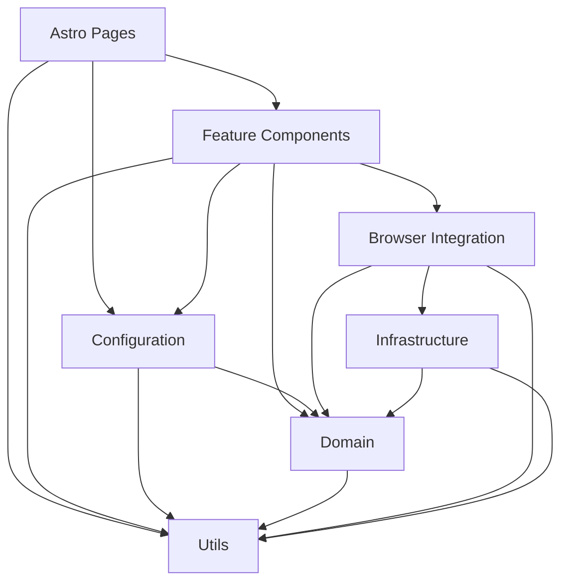

# Application Architecture

## Purpose

Earth Mama's Kitchen uses a configuration-driven frontend architecture for three Product Offerings and one Service Offering. The architecture separates business meaning from approved configuration, technical adapters, Astro presentation, and browser lifecycle code.

It is designed to remain understandable as the project grows without introducing a generic form engine, database, dependency-injection framework, or speculative enterprise abstractions.

## Principles

1. Every folder has one clear responsibility.
2. Business decisions remain framework-independent.
3. Reusable catalogue data is defined once and referenced by stable ID.
4. Offerings compose approved configuration rather than duplicate it.
5. Browser APIs and technical side effects remain outside the domain.
6. Astro pages and components render state; they do not own business rules.
7. Migration is incremental and preserves behaviour until the owning issue replaces it.
8. New abstractions require a demonstrated responsibility or reuse case.

## Source structure

Astro's conventional top-level folders remain visible. Presentation separation is expressed through focused subfolders instead of a `presentation` wrapper.

```text
src/
├── assets/                 Assets processed by Astro/Vite
├── browser/                Browser initialisation and Astro lifecycle integration
├── components/             Shared and feature-specific Astro components
│   ├── ui/                 Domain-agnostic shared controls
│   ├── navigation/         Application navigation
│   ├── catalogue/          Offering presentation
│   ├── preorder/           Configuration presentation
│   ├── cart/               Cart presentation
│   └── enquiries/          Contact and custom enquiries
├── configuration/          Approved application configuration
│   ├── catalogues/         Reusable catalogue definitions
│   ├── offerings/          Product and Service Offering definitions
│   ├── workflows/          Workflow definitions
│   └── rules/              Declarative rule instances
├── content/                Editorial content outside business configuration
├── domain/                 Framework-independent contracts and business logic
├── infrastructure/         Persistence, email, and synchronisation adapters
├── layouts/                Shared Astro application shells
├── pages/                  Astro route entrypoints
├── sections/               Page-level presentation sections
├── styles/                 Global and feature styling
└── utils/                  Generic framework-independent helpers only
```

Folders are created when they own real code. Empty directories are not committed merely to mirror the target tree.

## Ownership boundaries

### Domain

`src/domain` owns stable, framework-independent business concepts:

- branded ID contracts;
- money represented as integer AUD cents;
- allergen metadata contracts and derivation;
- Product Offering and Service Offering contracts;
- workflow and declarative rule types;
- pricing, compatibility, selection-limit, and cart business decisions.

Domain must not import Astro, browser APIs, application configuration, infrastructure, presentation, or editorial content. Domain calculations never belong in `utils`.

### Configuration

`src/configuration` owns approved business data and composition.

`configuration/catalogues` contains reusable definitions for add-ons, allergens, flavours, fillings, frostings, colour palettes, and occasions. A catalogue owns each entry's stable ID, customer-facing identity, and reusable defaults. Stable values are not repeated in a separate enum or central list.

`configuration/offerings/products` contains the three Product Offering definitions. `configuration/offerings/services` contains Events & Catering. Offerings reference catalogue IDs and own relationship-specific availability, ordering, selection limits, price overrides, review overrides, and compatibility. Catalogues do not contain reverse references to offerings.

`configuration/workflows` contains `guided-preorder`, `design-brief-preorder`, and `custom-enquiry`. Workflow-specific fields remain outside the common offering contract.

`configuration/rules` contains separate global, workflow, offering, and compatibility rule instances. The domain defines a closed rule union supporting only:

- `requires`;
- `excludes`;
- `auto-selects`;
- `limits-selection`;
- `redirects-to-enquiry`;
- `requires-review`.

Configuration contains no DOM access, CSS, Astro components, localStorage operations, or browser initialisation.

### Infrastructure

`src/infrastructure` owns technical adapters and side effects, grouped by responsibility:

- `persistence` for localStorage-backed persistence;
- `email` for mailto encoding and browser email handoff;
- `synchronisation` for BroadcastChannel coordination.

There is no generic `services` folder. Business operations belong in domain; technical integrations belong in infrastructure. Infrastructure may implement domain contracts but must not import configuration, browser entrypoints, pages, layouts, sections, or components.

### Presentation

Presentation uses Astro's conventional top-level folders:

- `components` for shared UI and feature components;
- `layouts` for application shells;
- `sections` for page-level compositions;
- `pages` for route entrypoints;
- `styles` for global and feature styling.

Components under `components/ui` contain no bakery-domain knowledge. Feature components may understand the domain and configuration for their feature.

Pages resolve route inputs, load approved configuration, define metadata, and compose layouts or components. Reusable calculations, persistence, and DOM lifecycle code do not belong in pages.

Presentation may load a browser entrypoint as an Astro composition concern, but it must not access infrastructure directly.

### Browser integration

`src/browser` initialises browser behaviour and connects rendered Astro markup to browser APIs. It owns:

- DOM event binding;
- Astro navigation lifecycle integration;
- starting cart, preorder, and enquiry interactions;
- connecting stable markup contracts to domain operations and infrastructure adapters.

`browser` is more precise than `client`, which could mean an HTTP client, API client, or any client-side module. Browser modules may depend on domain and infrastructure. They must never import pages, layouts, sections, components, or configuration. Integration uses stable markup contracts such as form names, IDs, and data attributes.

### Content

`src/content` contains editorial data such as awards or story content. It is not business configuration and cannot be referenced by domain or infrastructure.

### Utilities

`src/utils` is deliberately narrow.

> Utilities must never contain business logic.

Only generic, deterministic, framework-independent helpers belong there. Utilities cannot decide prices, allergens, compatibility, lead times, cart limits, offering availability, or workflow behaviour. They import no application layer.

## Dependency direction



| Source                        | Allowed dependencies                                        |
| ----------------------------- | ----------------------------------------------------------- |
| Domain                        | Utils                                                       |
| Configuration                 | Domain, Utils                                               |
| Infrastructure                | Domain, Utils                                               |
| Browser integration           | Domain, Infrastructure, Utils                               |
| Components, layouts, sections | Domain, Configuration, Browser, Utils                       |
| Pages                         | Domain, Configuration, presentation folders, Browser, Utils |
| Utils                         | Other utilities only                                        |

Prohibited dependencies include domain to any outer layer; configuration to infrastructure, browser, or presentation; infrastructure to configuration, browser, or presentation; browser to configuration or presentation; presentation directly to infrastructure; and utilities to any application layer.

ESLint enforces these boundaries with `no-restricted-imports`. Cross-boundary imports use the `@/*` alias so dependency direction is visible and enforceable.

## Import conventions

The project defines one alias:

```text
@/* → src/*
```

Use relative imports inside one cohesive folder:

```ts
import { addItem } from './cart';
```

Use the alias when crossing a top-level boundary:

```ts
import type { ProductOffering } from '@/domain/offerings';
import { addOnCatalogue } from '@/configuration/catalogues/add-ons';
```

Additional rules:

- do not introduce deep `../../../` imports;
- use `import type` for type-only dependencies;
- order imports as external packages, `@/` imports, then local imports;
- aliases do not permit bypassing dependency rules;
- avoid global barrel files;
- use a leaf barrel only for an intentional stable API or registry.

## Naming conventions

- Folders and TypeScript modules use `kebab-case`.
- Astro components and layouts use `PascalCase.astro`.
- Types use `PascalCase` without `I` prefixes.
- Values and registries use `camelCase`.
- Genuine global constants use `SCREAMING_SNAKE_CASE`.
- Stable IDs use immutable lowercase kebab-case strings.
- IDs are never derived from customer-facing names.
- Browser entrypoints describe what they initialise, such as `cart-page.ts`.
- Infrastructure modules describe their adapter, such as `cart-storage.ts`.

## Public assets

`public` contains only files that require a stable direct URL. Application JavaScript does not belong there. Suitable files include root favicons, a future `robots.txt`, and assets that genuinely require an unchanged public path.

Images that benefit from Astro optimisation should move to `src/assets` during EMK-020. Asset optimisation is not part of EMK-003.

## Migration strategy

| Issue   | Responsibility                                                                                                                                        |
| ------- | ----------------------------------------------------------------------------------------------------------------------------------------------------- |
| EMK-003 | Document boundaries, add alias enforcement, move browser scripts into the source graph, classify editorial content, and remove confirmed-unused files |
| EMK-004 | Replace `models/product.model.ts` and `consts/explore.ts` with domain contracts, catalogues, offerings, workflows, and rules                          |
| EMK-005 | Establish canonical IDs, slugs, and routes                                                                                                            |
| EMK-006 | Introduce shared UI foundations where reuse is demonstrated                                                                                           |
| EMK-007 | Restrict layout responsibilities and page-specific script loading                                                                                     |
| EMK-009 | Replace generic option rendering with typed feature components                                                                                        |
| EMK-010 | Separate typed cart state and persistence from DOM rendering                                                                                          |
| EMK-011 | Rebuild cart presentation and badge integration                                                                                                       |
| EMK-012 | Separate preorder message generation and mailto infrastructure                                                                                        |
| EMK-013 | Implement typed contact and enquiry handoffs                                                                                                          |
| EMK-020 | Audit, remove, and optimise visual assets                                                                                                             |
| EMK-021 | Finalise browser lifecycle and resource cleanup                                                                                                       |

### Transitional files

`src/models/product.model.ts` and `src/consts/explore.ts` remain temporarily in place. They mix responsibilities and are not templates for new development. EMK-004 owns their replacement, so EMK-003 avoids moving them merely to move them again.

The JavaScript modules moved from `public/js` into `src/browser` still combine responsibilities that later issues will separate. They are moved without redesigning behaviour. No new business logic should be added to them before their owning migration issues.

## Why this architecture

This structure demonstrates domain-driven and configuration-driven thinking while respecting Astro conventions. Stable business contracts remain independent of rendering and browser APIs. Approved configuration is composable, while technical adapters and DOM lifecycle code have explicit destinations.

It scales through focused subfolders and dependency rules rather than extra framework layers. The planned backlog can build on these boundaries without another top-level reorganisation, while the repository remains understandable to an engineer encountering it for the first time.
